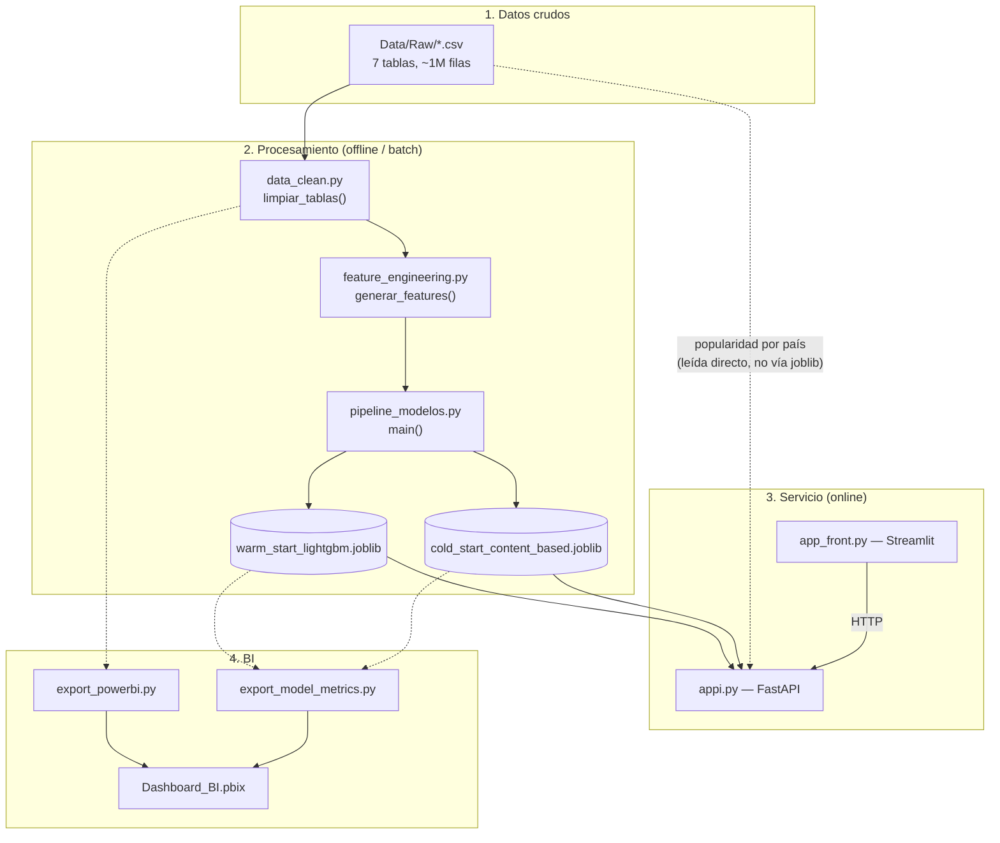

# Documentación Técnica — `ecommerce-clickstream-ml`

Documentación de referencia para quien mantenga o extienda el sistema: la organización de los componentes, el recorrido de los datos desde los CSV crudos hasta una recomendación servida por la API, y las decisiones de diseño detrás de cada parte.

---

## 1. Alcance y arquitectura del sistema

El proyecto está dividido en cuatro capas:

1. **Datos.** Las siete tablas CSV originales viven en `Data/Raw/` y son la fuente de todo lo que sigue: limpieza, features y entrenamiento.

2. **Procesamiento.** Limpieza (`data_clean.py`), ingeniería de características (`feature_engineering.py`) y entrenamiento de modelos (`pipeline_modelos.py`), que termina generando los artefactos serializados en `Models/*.joblib`.

3. **Servicios.** La API REST en FastAPI (`appi.py`) carga esos modelos y expone la inferencia; Streamlit (`app_front.py`) es el cliente que la consume.

4. **Analítica.** `export_powerbi.py` y `export_model_metrics.py` exportan datos limpios y métricas para alimentar el dashboard en Power BI (`Dashboard_BI.pbix`).



### Entrenamiento e inferencia, desacoplados

Entrenar un modelo y servirlo son dos procesos separados. `pipeline_modelos.py` corre de forma independiente, entrena y serializa con `joblib`; la API (`SRC/appi.py`) simplemente carga esos artefactos al arrancar y los mantiene en memoria mientras atiende requests, sin volver a entrenar nada en el camino.

Esto tiene una consecuencia práctica: si cambian los datos de entrada o el pipeline de entrenamiento, hay que correr `pipeline_modelos.py` de nuevo, regenerar los `.joblib` y actualizar la API con esa nueva versión. Las actualizaciones de modelo son manuales — el reentrenamiento incremental y la recarga dinámica quedan como posibles extensiones futuras.

---

## 2. Flujo completo del sistema

### 2.1 Flujo offline (entrenamiento)

```
Data/Raw/*.csv (7 tablas)
   │
   ▼  limpiar_tablas()                              [data_clean.py]
tablas limpias (events, sessions, reviews, orders, order_items, customers, products)
   │
   ▼  preparar_datos_modelado()                      [pipeline_modelos.py]
   ├─ generar_features() → matriz usuario-item, features de producto/usuario
   ├─ split temporal 80/20 (por timestamp de última interacción usuario-producto)
   ├─ recalculo de features de producto/usuario usando SOLO datos de train (anti-leakage)
   ├─ muestreo de negativos "duros" (probabilidad ∝ popularidad del producto)
   └─ stats de interacción usuario-categoría (solo train)
   │
   ├─▶ entrenar_warm_start(datos)   → LGBMClassifier + métricas
   └─▶ entrenar_cold_start(datos)   → vectores de producto + perfiles de usuario + calibrador logístico + métricas
   │
   ▼  main() empaqueta artefactos + datos de inferencia
Models/warm_start_lightgbm.joblib
Models/cold_start_content_based.joblib
```

### 2.2 Flujo online (inferencia, por request)

```
Streamlit (app_front.py)
   │  arma payload según tipo de usuario elegido
   ▼
POST /recommend  { customer_id, context: {age, country, category} }
   │
   ▼  appi.py: recommend()
   ├─ usuario_existe(customer_id) AND tiene_compras(customer_id)?
   │     │
   │     ├─ SÍ  → recomendar_warm_start()
   │     │         ├─ obtener_candidatos() (excluye vistos, filtra por top-4 categorías preferidas si hay ≥10 candidatos)
   │     │         ├─ arma DataFrame de features (usuario + contexto + producto + stats usuario-categoría)
   │     │         ├─ encoding categórico + imputación + escalado (mismos transformers del entrenamiento)
   │     │         ├─ modelo.predict_proba() → score_lgbm
   │     │         ├─ similitud coseno perfil_usuario vs. vectores de producto → score_content
   │     │         └─ score = 0.5·score_lgbm + 0.5·score_content
   │     │
   │     └─ NO  → ¿age Y country a nivel raíz del payload?
   │               ├─ SÍ → recomendar_cold_start_demographic() (usuarios similares por edad±5/país)
   │               └─ NO → recomendar_cold_start() (similitud coseno de contenido, o popularidad si no hay categoría)
   │
   ▼
JSON de respuesta → Streamlit → tabla (st.dataframe) al usuario
```

---

## 3. Módulos y responsabilidades

### `SRC/utils.py`

Funciones utilitarias de bajo nivel, sin dependencias de otros módulos del proyecto.

| Función | Firma | Responsabilidad |
|---------|-------|------------------|
| `cargarDatos` | `(nombre_archivo: str) -> pd.DataFrame` | Carga un CSV de `Data/Raw/` usando ruta absoluta calculada desde `__file__`. Construye la ruta en minúsculas (`"data"/"raw"`), pensada para sistemas de archivos insensibles a mayúsculas como Windows; en Linux o Mac esa ruta necesita ajustarse antes de ejecutar el pipeline. |
| `verificar_integridad_referencial` | `(child_df, child_col, parent_df, parent_col) -> int` | Cuenta las filas del hijo cuyo valor de FK no aparece en el padre. |
| `calcular_sets_eventos_sesion` | `(events: DataFrame) -> pd.Series` | Agrupa eventos por sesión y devuelve un `set` de `event_type` por sesión. Es una función utilitaria disponible para análisis puntuales; hoy ningún otro módulo la incorpora en su flujo. |
| `convertir_columnas_fecha` | `(df, date_columns: list) -> None` | Convierte columnas a `datetime` in-place con `pd.to_datetime`. `data_clean.py` resuelve lo mismo con su propia `convertir_fechas()`, pensada específicamente para el pipeline de limpieza. |

### `SRC/data_clean.py`

Pipeline de limpieza, con un único punto de entrada: `limpiar_tablas(ruta_data="Data/Raw") -> tuple[7 DataFrames]`. El parámetro `ruta_data` queda reservado para una futura extensión: `cargarDatos()` resuelve la ruta internamente y todavía no lo recibe.

Constantes relevantes: `EMAIL_PATTERN` (regex de validación) y `ROUNDING_TOLERANCE_USD = 0.011` (tolerancia para comparar montos en punto flotante).

`limpiar_tablas()` ejecuta, en este orden:

1. `convertir_fechas()` — castea columnas de fecha a `datetime64[us]` en las 5 tablas que las tienen.
2. `clean_customers()` — nulos, duplicados, `age` en [18,100], formato de email.
3. `clean_products()` — nulos, duplicados, `price_usd`/`cost_usd` > 0, `cost_usd ≤ price_usd`, `margin_usd ≈ price_usd - cost_usd` (con la tolerancia `ROUNDING_TOLERANCE_USD`).
4. `corregir_coherencia_temporal_orders(orders, customers)` — para cada orden con `order_time < signup_date` del cliente, reasigna `order_time = signup_date + offset aleatorio(0, 365 días)`; el generador `numpy.random` usa `RANDOM_STATE=42`, definido en este mismo archivo (no se importa de `pipeline_modelos.py`).
5. `clean_orders()` — nulos, duplicados, montos > 0, `discount_pct` en [0,100], `total_usd` consistente con `subtotal_usd` y el descuento, FK a `customers`.
6. `clean_order_items()` — elimina duplicados exactos, valida `line_total_usd ≈ unit_price_usd × quantity`, FK a `products`/`orders`.
7. `eliminar_duplicados_events()` / `eliminar_duplicados_sessions()` — verifican duplicados exactos; los datos actuales ya llegan limpios en estas dos tablas.
8. `eliminar_duplicados_reviews()` — dos pasadas: duplicados exactos por `(order_id, product_id, rating)`, y contradicciones por `(order_id, product_id)` con distinto rating, resueltas conservando la fecha más reciente (`keep="last"` tras ordenar).
9. `eliminar_review_text()` — dropea la columna.
10. `reportar_clientes_sesiones()` — solo imprime un reporte, no modifica ningún DataFrame.
11. `corregir_coherencia_temporal()` — ajusta `events.timestamp`, `sessions.start_time` y `reviews.review_time` para que respeten `signup_date ≤ order_time/start_time/timestamp` y `review_time ≥ order_time` del pedido asociado.
12. `validar_integridad()` — corre 7 chequeos FK→PK y los reporta, sin corregir nada.

Hay además una función opcional, lista para habilitarse cuando se necesite: `winsorizar_amount_usd(events, percentil=99)`, pensada para recortar outliers de `amount_usd` en eventos `purchase`. Está disponible comentada dentro de `limpiar_tablas()` (línea 593).

### `SRC/feature_engineering.py`

Punto de entrada: `generar_features(ruta_data="Data/Raw") -> (interaction_matrix, product_features, user_features, user_item_df, events_con_user)`. El parámetro `ruta_data` sigue el mismo patrón que en `data_clean.py`: reservado para una futura extensión.

| Función | Responsabilidad |
|---------|------------------|
| `crear_matriz_usuario_item(events, sessions)` | Une eventos con sesiones para obtener `customer_id`, pondera por `EVENT_WEIGHTS = {"page_view":1, "add_to_cart":3, "purchase":5}` (el diccionario no incluye una ponderación específica para `"checkout"`, que en consecuencia adopta el mismo peso que `page_view`), y agrupa por `(customer_id, product_id)`. |
| `crear_features_producto(products, events_con_user, reviews, order_items, orders)` | Agrega conteos de vistas/carrito/compras desde `events`, popularidad (compradores únicos) desde `order_items` y rating promedio/cantidad desde `reviews`. Devuelve una fila por producto, con 10 features más `product_id`. |
| `crear_features_usuario(customers, sessions, events_con_user, orders, order_items, reviews)` | Agrega sesiones, compras, ticket promedio, productos vistos/carritados y rating dado. Devuelve una fila por usuario, con 9 features más `customer_id`. |
| `preprocesar_para_modelado(matriz, features_producto, features_usuario)` | Pivotea la matriz a formato denso usuario×producto, aplica `LabelEncoder` a `category`/`country` y `StandardScaler` a las columnas numéricas de producto y usuario. |

### `SRC/pipeline_modelos.py`

Es el módulo de entrenamiento reproducible para producción: replica la metodología del notebook 05, pero solo para los dos modelos elegidos (LightGBM warm-start, Content-Based cold-start), no para los seis que se comparan ahí.

Constantes relevantes: `TOP_K=10`, `RANDOM_STATE=42`, `EARLY_STOPPING_ROUNDS=30`, `EVENT_WEIGHTS` (idéntico al de `feature_engineering.py`, pero duplicado en vez de importado), `FEATURE_COLS` (24 columnas, detalladas en la sección 5.1) y `NUMERIC_COLS_CONTENT` (9 columnas para el vector de contenido).

| Función | Responsabilidad |
|---------|------------------|
| `rank_metrics_por_usuario(df_scores, top_k)` | Calcula MAP@K y NDCG@K agrupando por `customer_id`, rankeando los candidatos de cada usuario por separado y promediando solo sobre usuarios con al menos un positivo. |
| `_split_temporal(user_item_df, events_con_user, train_frac=0.8)` | Corta por el percentil 80 de `timestamp` de la última interacción de cada par `(customer_id, product_id)`. |
| `_samplear_negativos_duros(n, customer_pool, product_pool, product_probs, observed, rng)` | Muestrea pares `(customer_id, product_id)` no observados, con probabilidad de producto proporcional a su popularidad en train. |
| `preparar_datos_modelado()` | Orquesta todo el proceso: features → split temporal → recalculo de features solo con train → negativos duros → stats usuario-categoría (solo train) → imputación por mediana → escalado (`StandardScaler`, solo columnas numéricas de producto) → `class_weight="balanced"` vía `compute_sample_weight`. |
| `entrenar_warm_start(datos)` | `LGBMClassifier(n_estimators=250, learning_rate=0.05, max_depth=7, subsample=0.8, colsample_bytree=0.8, random_state=42)`, con 15% de train reservado para validación interna y early stopping a 30 rondas sin mejora en `binary_logloss`. |
| `entrenar_cold_start(datos)` | Vectoriza productos (9 numéricos escalados + categoría one-hot), arma el perfil de cada usuario como promedio ponderado (por `EVENT_WEIGHTS`) de los vectores de los productos con los que interactuó en train, y calibra con `LogisticRegression(class_weight="balanced")` sobre el score de similitud coseno. |
| `main()` | Ejecuta todo el pipeline, arma los diccionarios `warm_artifacts`/`cold_artifacts` (detallados en la sección 5.3) y los serializa con `joblib.dump`. |

### `SRC/appi.py` y `SRC/app_front.py`

Se documentan en detalle en las secciones 6 y 7.

### `SRC/export_model_metrics.py` y `SRC/export_powerbi.py`

Scripts de exportación para BI, documentados en la sección de Despliegue del README. `export_powerbi.py` reutiliza `limpiar_tablas()` en vez de duplicar la lógica de limpieza, y al final invoca internamente a `export_model_metrics.exportar_metricas()`.

### `run_pipeline.py`

Orquestador de alto nivel: ejecuta en subprocesos `SRC/pipeline_modelos.py` → `SRC/export_powerbi.py` → (opcionalmente) `uvicorn SRC.appi:app` y `streamlit run SRC/app_front.py`.

---

## 4. Dependencias

La lista completa está en `README.md`. Vale la pena aclarar tres cosas que no quedan ahí:

- **`lightgbm`** necesita la librería de sistema `libgomp1` para el paralelismo OpenMP — por eso el `Dockerfile` la instala explícitamente con `apt-get` antes del `pip install`. Fuera de Docker, en una imagen base mínima sin esa librería, `import lightgbm` falla.
- **`catboost` y `ngboost`** se importan y entrenan en el Notebook 05, así que son dependencias reales del proyecto, pero no figuran en `requirements.txt`. No hacen falta para correr la API ni el frontend (que en inferencia solo dependen de LightGBM y scikit-learn), solo para reproducir el notebook de comparación de modelos.
- **`pydantic`** no incluye una versión fijada, como tampoco la incluye `fastapi` — lo que deja abierta la posibilidad de que `pip` resuelva una versión de Pydantic v2 con cambios incompatibles respecto a la que se usó en desarrollo. Confirmarlo con certeza requeriría un `pip freeze` original, que no quedó guardado en el repositorio.

## 5. Modelos — detalle técnico

### 5.1 Warm Start — LightGBM (`Models/warm_start_lightgbm.joblib`)

**Tipo:** clasificación binaria (interactuó / no interactuó), usada como score de ranking a través de `predict_proba()[:, 1]`.

**Hiperparámetros** (`SRC/pipeline_modelos.py`, `entrenar_warm_start`):

```python
lgb.LGBMClassifier(
    n_estimators=250,
    learning_rate=0.05,
    max_depth=7,
    subsample=0.8,
    colsample_bytree=0.8,
    random_state=42,
    n_jobs=-1,
)
```

Se entrena con `sample_weight` balanceado por clase (`compute_sample_weight(class_weight="balanced")`), reservando 15% del train como validación interna y con early stopping a 30 rondas sin mejora en `binary_logloss`.

**Features (`FEATURE_COLS`, 24 en total):**

```
age, country, marketing_opt_in, n_sessions, n_purchases_user, ticket_promedio,
n_products_viewed, n_products_carted, rating_promedio_usr,
price_usd, cost_usd, margin_usd, popularidad, rating_promedio, n_views,
n_cart, n_purchases_product, n_ratings, category,
user_cat_n_views, user_cat_n_cart, user_cat_n_purchases,
user_cat_total_score, user_cat_score_ratio
```

Las últimas 5 (`user_cat_*`) son features de interacción usuario-categoría, calculadas solo con datos de train y agregadas por `(customer_id, category)`.

**Preprocesamiento en inferencia** (tiene que reproducir exactamente el del entrenamiento, y `appi.py` lo hace): imputación por mediana (`SimpleImputer`, ajustado en train) → escalado (`StandardScaler`, solo columnas numéricas de producto) → mapeo de categóricas (`country`, `category`) según `category_mappings` aprendido en train, con las categorías no vistas cayendo en una clase "desconocida" separada.

### 5.2 Cold Start — Content-Based Filtering (`Models/cold_start_content_based.joblib`)

**Tipo:** similitud de coseno entre el perfil de un usuario y los vectores de producto, calibrada con regresión logística para reportar métricas de clasificación (esa calibración no interviene en el endpoint de recomendación, que trabaja directo sobre el score de similitud).

**Vector de producto:** 9 columnas numéricas escaladas (`NUMERIC_COLS_CONTENT`: `price_usd, cost_usd, margin_usd, popularidad, rating_promedio, n_ratings, n_views, n_cart, n_purchases`) más la categoría en one-hot.

**Perfil de usuario:** el promedio ponderado (peso = `EVENT_WEIGHTS` del evento) de los vectores de todos los productos con los que interactuó en train. Los usuarios sin interacciones en ese período quedan con perfil en cero.

### 5.3 Contenido exacto de los artefactos `.joblib`

**`warm_start_lightgbm.joblib`** (dict):
`modelo, feature_cols, imputer, scaler_products, product_numeric_cols, category_mappings, products, customers, product_features, user_features, historial_usuario, categoria_favorita, preferencias_categoria, user_cat_stats, reverse_country_mapping, metrics`

**`cold_start_content_based.joblib`** (dict):
`scaler, category_columns, numeric_cols, product_vectors, product_ids, calibrador, perfiles_usuario, products, product_features, metrics`

Ambos diccionarios incluyen los DataFrames `products`, `customers`, `product_features` y `user_features` completos, así que los artefactos son autocontenidos: la API no necesita releer `Data/Raw/` para recomendar a un usuario existente. Una excepción puntual es el cálculo de popularidad por país (`POPULARIDAD_PAIS`, usado para segmentar el cold-start cuando no hay categoría), que sí lee `Data/Raw/orders.csv` y `Data/Raw/order_items.csv` directamente al arrancar `appi.py`. Por eso conviene sumar ese directorio al `Dockerfile` para que la inicialización de la API quede completa al correr en contenedor.

---

## 6. API — referencia técnica completa (`SRC/appi.py`)

### 6.1 Secuencia de arranque (a nivel de módulo, corre una sola vez al importar)

1. Instancia `FastAPI(title=..., description=..., version="1.0.0", contact={"name": "Equipo Data Science"})`.
2. Carga los dos `.joblib` con `joblib.load()`. Si falla, lanza `RuntimeError`: el servidor no llega a levantarse si los modelos no terminaron de cargar, para evitar que quede corriendo en un estado parcial.
3. Desempaqueta cerca de 20 variables globales desde ambos diccionarios: historial de usuario, categoría favorita, preferencias por categoría, el modelo LightGBM, imputer, scalers, mappings, catálogo, features, vectores de contenido y perfiles de usuario.
4. Lee `Data/Raw/orders.csv` y `Data/Raw/order_items.csv` (con `usecols` acotado a lo necesario) y calcula `POPULARIDAD_PAIS` / `PRODUCTOS_POR_PAIS` — diccionarios de país a `{product_id: cantidad de compras}`.
5. Normaliza `CATALOGO["category"]` a minúsculas y sin espacios extra, y arma `CATALOGO_NOMBRES` (product_id → nombre) y `TODOS_LOS_PRODUCTOS` (lista de IDs).
6. Arma `PRODUCTOS_DB` (product_id → dict de features, resultado de mergear `product_features` con columnas de `products`) y `USUARIOS_DB` (customer_id → dict de features).

Si cualquiera de estos pasos falla, `uvicorn` no llega a levantar el servidor: el arranque se trata como una unidad, sin estados intermedios.

### 6.2 Modelo de datos de la solicitud

```python
class RecommendationRequest(BaseModel):
    customer_id: int
    context: dict = {}
    country: str = None
    age: int = None
```

Pydantic valida automáticamente que `customer_id` esté presente y sea `int` (FastAPI responde `422 Unprocessable Entity` si falta o no castea). El resto de los campos son opcionales.

### 6.3 Funciones internas relevantes

| Función | Qué hace |
|---------|----------|
| `usuario_existe(customer_id)` | `customer_id in USUARIOS_DB` |
| `obtener_usuario(customer_id)` | Devuelve el dict de features del usuario, decodificando `country` desde su forma numérica (label-encoded) al código real vía `REVERSE_COUNTRY_MAPPING` |
| `tiene_compras(customer_id)` | `usuario.get("n_purchases_user", 0) > 0` |
| `obtener_candidatos(customer_id, context)` | Excluye productos ya vistos (`HISTORIAL_USUARIO`). Si el usuario tiene preferencias de categoría registradas (`PREFERENCIAS_CATEGORIA`) y filtrar por sus 4 categorías top deja 10 o más candidatos, restringe a esas categorías; si no, usa el catálogo completo menos lo ya visto |
| `recomendar_cold_start(customer_id, context, top_k)` | Si el usuario tiene un perfil real en `PERFILES_USUARIO` (interactuó durante el entrenamiento aunque nunca haya comprado), lo usa. Si no, arma un vector a partir de `context["category"]`, con la parte numérica en cero para no sesgar por una categoría no informada. Sin categoría, cae a un ranking por popularidad, general o por país si `context["country"]` llegó informado |
| `recomendar_cold_start_demographic(context, top_k)` | Busca en `USUARIOS_DB` usuarios con compras, mismo país y edad dentro de ±5 años; cuenta la frecuencia de productos vistos entre ellos (filtrando por categoría si se especificó) y rankea por esa frecuencia relativa. Se activa cuando `age`/`country` llegan en la raíz del request, un escenario que la interfaz actual de Streamlit todavía no genera |
| `recomendar_warm_start(customer_id, context, top_k)` | El flujo completo está detallado en la sección 2.2 |

### 6.4 Especificación de endpoints

#### `GET /`
Sin parámetros. Respuesta:
```json
{"status": "running", "api": "E-commerce Recommendation API", "warm_model": "LightGBM", "cold_model": "Content Based", "n_products": 1197, "n_users": 20000}
```

#### `GET /health`
```json
{"status": "healthy"}
```

#### `POST /recommend`
El flujo está detallado en la sección 2.2 y en `README.md`. Ante cualquier excepción no controlada dentro del bloque `try`, responde `500` con `detail=str(e)`, capturando el error de manera uniforme.

#### `GET /model-metrics`
```json
{"warm_start": {"accuracy": ..., "precision": ..., "recall": ..., "f1": ..., "map@k": ..., "ndcg@k": ..., "n_usuarios_evaluados": ...}, "cold_start": {...}}
```
Devuelve tal cual el dict `metrics` guardado en cada `.joblib` durante el entrenamiento; no recalcula nada al vuelo.

#### `GET /products`
Devuelve `CATALOGO.to_dict(orient="records")`, el catálogo completo, sin paginar. Con 1,197 productos el payload es manejable, pero valdría la pena paginar antes de escalar a un catálogo de otro orden de magnitud.

#### `GET /users/{customer_id}`
Responde `404` con `detail="Usuario no encontrado."` si `customer_id` no está en `USUARIOS_DB`. Si existe, devuelve el dict completo de features, con `country` ya decodificado a texto.

#### `GET /users-list`
Sin parámetros. Filtra `customers[customers["n_purchases_user"] > 0]` y devuelve `[{"customer_id", "name", "email"}, ...]`, pensado como fuente simple para poblar el selector de usuarios del frontend.

---

## 7. Frontend — referencia técnica (`SRC/app_front.py`)

**Gestión de estado:** el frontend utiliza `st.session_state["resultado"]` para conservar la última recomendación generada durante la sesión. El contenido permanece disponible entre las recargas de Streamlit hasta que el usuario solicita una nueva recomendación o utiliza la opción **"🗑 Limpiar resultados"**.

**Cacheo de datos:** las funciones encargadas de consultar la API (`obtener_estado_api`, `obtener_metricas`, `obtener_usuario` y `obtener_lista_usuarios`) emplean `@st.cache_data(ttl=60)`, manteniendo en caché las respuestas durante 60 segundos para reducir llamadas repetidas y mejorar el tiempo de respuesta. El botón **"🔄 Actualizar"** del panel lateral limpia la caché y vuelve a ejecutar la aplicación.

**Manejo de comunicación con la API:** las solicitudes realizadas mediante `requests.get` se encapsulan en bloques `try/except`, permitiendo que la aplicación continúe funcionando aun cuando se presenten inconvenientes de conectividad. Si la API no está disponible, el frontend informa el estado al usuario mediante el indicador **"🔴 API desconectada"** y detiene temporalmente la ejecución hasta que el servicio vuelva a estar disponible.

**Configuración de la aplicación:** algunos parámetros se encuentran definidos directamente en el código fuente, entre ellos:

- `API_URL = "https://ecommerce-clickstream-ml.onrender.com"`
- `PAISES`: diccionario que relaciona los códigos de los 17 países soportados con su nombre.
- `CATEGORIAS`: lista de categorías disponibles para realizar recomendaciones, incluyendo la opción **"Todas las categorías"**.
## 8. Configuración y variables de entorno

La configuración del proyecto se define directamente en el código, en vez de externalizarse a variables de entorno — aunque `python-dotenv` figura entre las dependencias declaradas en `requirements.txt`:

| Configuración | Valor | Ubicación |
|---|---|---|
| URL de la API que consume el frontend | `https://ecommerce-clickstream-ml.onrender.com` | `SRC/app_front.py`, constante `API_URL` |
| Host/puerto de la API (local) | `127.0.0.1:8000` | `run_pipeline.py`, constantes `API_HOST`/`API_PORT` |
| Puerto del frontend (local) | `8501` | `run_pipeline.py`, constante `FRONTEND_PORT` |
| Semilla aleatoria | `42` | Se redefine por separado en `data_clean.py` y `pipeline_modelos.py` (`RANDOM_STATE`) — no hay una única fuente de verdad, aunque ambas usan el mismo valor |
| Rutas de modelos | `Models/warm_start_lightgbm.joblib`, `Models/cold_start_content_based.joblib` | `SRC/appi.py`, como rutas relativas definidas directamente en el código |

**En la práctica**, apuntar el frontend a una API distinta (staging, otra instancia local) implica editar `SRC/app_front.py` directamente y volver a desplegar, ya que la configuración no se externaliza todavía.

## 9. Estructura del proyecto

El árbol completo está en `README.md`, sección "Estructura del repositorio".

Estas carpetas se generan localmente y no están versionadas (quedan excluidas vía `.gitignore`: `*Processed`, `*PowerBI`, `Data/PowerBI/`, `catboost_info/`):
- `Data/Processed/` — salida de `feature_engineering.py`
- `Data/PowerBI/` — salida de `export_powerbi.py` / `export_model_metrics.py`
- `catboost_info/` — logs que genera CatBoost al entrenar (notebook 05)

## 10. Decisiones técnicas documentadas

Las siguientes decisiones forman parte del diseño del sistema y responden a criterios de calidad del modelo, consistencia del entrenamiento y adecuación al problema de recomendación planteado.

1. **Split temporal en lugar de aleatorio** (`_split_temporal`, `pipeline_modelos.py`): el conjunto de entrenamiento y prueba se divide respetando el orden cronológico de las interacciones. Este enfoque evita incorporar información futura durante el entrenamiento y permite evaluar el modelo en un escenario más cercano al uso real.

2. **Muestreo de negativos basado en popularidad** (`_samplear_negativos_duros`): los ejemplos negativos se generan considerando la popularidad de los productos, lo que produce un conjunto de entrenamiento más representativo y obliga al modelo a aprender patrones de preferencia más allá de la simple popularidad.

3. **Recalculo de características utilizando únicamente datos de entrenamiento** (`preparar_datos_modelado`): las variables agregadas, como popularidad, calificaciones y estadísticas por categoría, se construyen exclusivamente con información disponible durante el entrenamiento, preservando la independencia entre entrenamiento e inferencia.

4. **Calibración del modelo de cold-start utilizando únicamente datos de entrenamiento** (`entrenar_cold_start`): la regresión logística utilizada para calibrar las probabilidades se ajusta únicamente con información del conjunto de entrenamiento, manteniendo la consistencia del proceso de evaluación.

5. **Selección dinámica entre estrategias Warm Start y Cold Start**: el sistema utiliza automáticamente el modelo más adecuado según la información disponible de cada usuario. Los usuarios con historial de interacción reciben recomendaciones mediante LightGBM, mientras que los usuarios nuevos son atendidos mediante el enfoque Content-Based, garantizando cobertura para ambos escenarios.

6. **Combinación de modelos mediante un blend 50/50** (`ALPHA = 0.5`, `appi.py`): para usuarios con historial se combinan las predicciones de LightGBM y la similitud basada en contenido, buscando aprovechar tanto los patrones aprendidos por el modelo supervisado como la información semántica de los productos.

### 11. Limitaciones

Como ocurre en la mayoría de proyectos desarrollados en un contexto académico, algunas decisiones de implementación responden al alcance y al tiempo disponible para el desarrollo. Los siguientes aspectos representan oportunidades de evolución del sistema en futuras iteraciones:

- El conjunto de datos utilizado es sintético, por lo que las distribuciones de comportamiento entre segmentos son más homogéneas que las que se encontrarían en un entorno real. Esto limita el potencial de algunos atributos demográficos para diferenciar patrones de compra.

- La resolución de rutas de datos está adaptada al entorno de desarrollo utilizado durante el proyecto. Para garantizar compatibilidad completa entre distintos sistemas operativos, puede incorporarse una gestión de rutas totalmente independiente de la plataforma.

- La imagen Docker puede ampliarse incorporando el directorio `Data/`, permitiendo que la API disponga de todos los recursos necesarios durante su inicialización en un entorno contenerizado.

- La estrategia de recomendaciones para usuarios nuevos basada en información demográfica ya se encuentra implementada en la API. Como evolución del proyecto, esta funcionalidad puede integrarse también en la interfaz desarrollada con Streamlit.

- La API fue diseñada para un entorno de demostración y pruebas. En un escenario de producción sería recomendable incorporar mecanismos de autenticación y control de acceso.

- La configuración del sistema (URLs, rutas y puertos) se encuentra definida directamente en el código. Externalizar estos parámetros mediante variables de entorno facilitaría la administración del proyecto en diferentes ambientes de despliegue.

- El manejo de excepciones prioriza la simplicidad y estabilidad del flujo de ejecución. En futuras versiones podría enriquecerse con una clasificación más específica de errores para facilitar tareas de monitoreo y diagnóstico.

- Los endpoints `GET /products` y `GET /users-list` responden adecuadamente al volumen actual de información. En escenarios con catálogos significativamente mayores, la incorporación de mecanismos de paginación mejoraría la eficiencia de las consultas.

- La combinación de los modelos mediante un peso fijo (`ALPHA = 0.5`) ofrece un comportamiento estable durante las pruebas realizadas. Como línea de mejora, este parámetro podría optimizarse experimentalmente para distintos escenarios de recomendación.

