<div align="center">

# 🛒 E-commerce Clickstream ML
### Sistema Inteligente de Recomendación de Productos

*Proyecto final — Bootcamp de Data Science, Henry · Metodología CRISP-DM*


</div>

---

## 📑 Índice

- [ Resumen ejecutivo](#-resumen-ejecutivo)
- [ Equipo de trabajo](#-equipo-de-trabajo)
- [Contexto y valor de negocio](#-contexto-y-valor-de-negocio)
- [ Arquitectura de la solución](#️-arquitectura-de-la-solución)
- [ Estructura del repositorio](#-estructura-del-repositorio)
- [Dataset](#-dataset)
- [Pipeline de datos (CRISP-DM)](#-pipeline-de-datos-crisp-dm)
- [Motor de recomendación](#-motor-de-recomendación)
- [API REST](#-api-rest)
- [Frontend (Streamlit)](#-frontend-streamlit)
- [Dashboard Power BI](#-dashboard-power-bi)
- [🐳 Despliegue](#-despliegue)
- [▶️ Cómo ejecutar](#️-cómo-ejecutar)
- [Dependencias](#-dependencias)

---

# 🔎 Resumen ejecutivo

Este proyecto presenta una solución integral de recomendación para una plataforma de comercio electrónico, desarrollada con el propósito de mejorar la experiencia del cliente, incrementar las oportunidades de conversión y apoyar la toma de decisiones mediante analítica de datos. La solución integra un motor híbrido de recomendación basado en Machine Learning, una API REST desarrollada con FastAPI, una aplicación web en Streamlit y un dashboard ejecutivo en Power BI, conformando una arquitectura que permite consumir recomendaciones en tiempo real y visualizar indicadores relevantes del negocio.

<table>
<tr>

<td width="33%" valign="top">

### 🎯 Problema de negocio

Los clientes interactúan únicamente con una pequeña parte del catálogo disponible, lo que dificulta ofrecer recomendaciones personalizadas y limita las oportunidades de conversión y venta.

</td>

<td width="33%" valign="top">

### 💡 Solución propuesta

Se desarrolló un sistema híbrido de recomendación que identifica automáticamente el tipo de usuario y utiliza el modelo más adecuado para generar recomendaciones personalizadas tanto para usuarios con historial como para nuevos clientes.

</td>

<td width="33%" valign="top">

### 🚀 Resultado

La solución integra un pipeline de datos, modelos de Machine Learning, una API REST, una aplicación web y un dashboard ejecutivo, proporcionando una plataforma completa para la generación y consumo de recomendaciones.

</td>

</tr>
</table>

| Aspecto | Descripción |
|---------|-------------|
| **Metodología** | Desarrollo basado en CRISP-DM, desde el entendimiento del negocio hasta el despliegue de la solución. |
| **Motor de recomendación** | Estrategia híbrida compuesta por LightGBM (Warm Start) y Content-Based Filtering (Cold Start). |
| **Arquitectura** | Pipeline de datos, Machine Learning, API REST (FastAPI), Frontend (Streamlit) y Dashboard (Power BI). |
| **Cobertura** | Más de 1 millón de registros, aproximadamente 20.000 clientes, 1.197 productos, 17 países y 7 categorías. |

---

# 👥 Equipo de trabajo

Proyecto desarrollado como parte del **Bootcamp de Data Science de Henry**, aplicando metodologías ágiles y trabajo colaborativo para diseñar, desarrollar e implementar una solución integral de recomendación para e-commerce.

| Integrante | Rol y participación |
|------------|---------------------|
| **Yustin Rodríguez** | Coordinación general, Scrum Master, arquitectura de la solución, integración del repositorio, desarrollo del pipeline de datos, Backend (FastAPI), Frontend (Streamlit), Dashboard en Power BI, despliegue y documentación técnica. |
| **Elías Mana** | Desarrollo, entrenamiento, optimización y evaluación de los modelos de Machine Learning utilizados por el sistema de recomendación. |
| | **Carina Belén** | Análisis exploratorio de datos (EDA), análisis de negocio, desarrollo del Backend (FastAPI), integración de la API REST con el sistema de recomendación, apoyo en el despliegue de la solución, documentación funcional y validación de resultados. |
| **Rocío Muñoz** | Preparación y limpieza de datos, apoyo al análisis exploratorio (EDA), desarrollo del Frontend (Streamlit), implementación del orquestador de la aplicación, integración de componentes, apoyo en el despliegue de la solución y aseguramiento de la calidad de los datos. |

De esa forma queda claro que:

---

# 💼 Contexto y valor de negocio

## El desafío

En el comercio electrónico, uno de los principales retos consiste en conectar a cada cliente con los productos que realmente pueden ser de su interés. A medida que aumenta el tamaño del catálogo y el número de usuarios, ofrecer las mismas recomendaciones para todos deja de ser una estrategia efectiva, reduciendo las oportunidades de conversión y afectando la experiencia de compra.

Para este proyecto se trabajó con una plataforma de e-commerce conformada por aproximadamente **20.000 clientes**, **1.197 productos**, presencia en **17 países** y más de **un millón de registros** correspondientes a sesiones, eventos de navegación, compras e interacciones.

El análisis exploratorio permitió identificar que la matriz usuario-producto presenta una **dispersión del 97.78 %**, una característica típica de los sistemas de recomendación, donde la mayoría de los usuarios interactúa únicamente con una pequeña parte del catálogo disponible. Esto hace necesario implementar mecanismos de personalización que permitan mostrar productos relevantes según el contexto de cada cliente.

Asimismo, el análisis del embudo de conversión permitió identificar el principal punto de fricción dentro del proceso de compra.

| Etapa del funnel | Sesiones que la alcanzan | Conversión desde la etapa anterior |
|------------------|-------------------------:|-----------------------------------:|
| `page_view` | 120,000 | — |
| `add_to_cart` | 81,518 | 67.9 % |
| `checkout` | 44,909 | **55.1 %** |
| `purchase` | 33,580 | 74.8 % |

La mayor pérdida de usuarios ocurre entre **Agregar al carrito** e **Iniciar el proceso de compra**, representando una oportunidad para mejorar la conversión mediante recomendaciones personalizadas en uno de los momentos más importantes del recorrido del cliente.

## Nuestra propuesta de valor

Como equipo de consultoría desarrollamos una solución híbrida de recomendación capaz de adaptarse automáticamente al comportamiento de cada usuario. En lugar de aplicar una única estrategia, el sistema identifica si existe historial de interacción y selecciona el modelo más apropiado para cada escenario.

Para usuarios con historial se implementó un modelo **Warm Start** basado en **LightGBM**, capaz de aprovechar el comportamiento histórico para generar recomendaciones altamente personalizadas. Para nuevos usuarios o productos sin historial se implementó un modelo **Cold Start** basado en **Content-Based Filtering**, que recomienda productos utilizando únicamente sus características y atributos.

Ambos motores se integran detrás de una única **API REST** desarrollada con FastAPI, permitiendo que aplicaciones web, móviles u otros sistemas consuman recomendaciones de forma centralizada. Como complemento, se desarrolló una aplicación en **Streamlit** para la demostración funcional de la solución y un **dashboard en Power BI** orientado al seguimiento de indicadores y apoyo a la toma de decisiones.

## Impacto esperado

La implementación de esta solución busca fortalecer la personalización de la experiencia de compra, incrementar la probabilidad de conversión y facilitar el descubrimiento de productos relevantes para cada cliente.

El análisis del negocio muestra un **ticket promedio de USD 133.81** (mediana de **USD 86.46**), evidenciando oportunidades para aumentar el valor de las compras mediante recomendaciones oportunas. Además, el **57.6 %** de las compras incluyen algún descuento, reflejando una alta sensibilidad al precio y la importancia de recomendar el producto adecuado en el momento correcto.

Los modelos desarrollados alcanzaron un **NDCG@10 cercano a 0.93**, demostrando una alta capacidad para posicionar los productos más relevantes dentro de las primeras recomendaciones, aspecto fundamental en plataformas de comercio electrónico donde la mayoría de las decisiones del usuario se concentran en los primeros resultados mostrados. En conjunto, la solución proporciona una arquitectura escalable, reutilizable e integrable con otros canales digitales, aportando valor tanto para la experiencia del cliente como para la estrategia comercial de la organización.

---

### 👥 Usuarios objetivo

La solución fue diseñada para generar valor a diferentes actores dentro del ecosistema del comercio electrónico, permitiendo que cada uno interactúe con el sistema de acuerdo con sus necesidades.

| Perfil | Valor que aporta la solución |
|--------|------------------------------|
| 🛍️ **Clientes de la plataforma** | Reciben recomendaciones personalizadas que facilitan el descubrimiento de productos relevantes y mejoran la experiencia de compra. |
| 📊 **Equipo de negocio y tomadores de decisión** | Consultan el dashboard de Power BI para analizar indicadores de desempeño, comportamiento de los usuarios y resultados del sistema de recomendación. |
| 👨‍💻 **Equipos de tecnología e integraciones** | Consumen la API REST para incorporar el motor de recomendación en aplicaciones web, móviles o cualquier otro canal digital de la organización. |

### 💼 Casos de uso

El sistema selecciona automáticamente la estrategia de recomendación más adecuada según el contexto del usuario, garantizando una experiencia consistente tanto para clientes nuevos como para usuarios recurrentes.

| Escenario | Solución aplicada | Beneficio para el negocio |
|-----------|-------------------|---------------------------|
| Usuario con historial de compras o navegación | **Warm Start (LightGBM)** | Genera recomendaciones altamente personalizadas aprovechando el comportamiento histórico del cliente. |
| Usuario nuevo que indica una categoría de interés | **Cold Start (Content-Based)** | Permite ofrecer recomendaciones desde la primera interacción sin depender de compras previas. |
| Usuario nuevo sin información disponible | **Ranking por popularidad** | Garantiza que siempre existan productos sugeridos, evitando experiencias vacías. |
| Usuario nuevo con información demográfica | **Cold Start Demográfico** | Permite generar recomendaciones utilizando perfiles de usuarios similares. Actualmente esta funcionalidad se encuentra implementada en la API y puede incorporarse fácilmente a futuras versiones de la interfaz web. |

### Flujo funcional del sistema

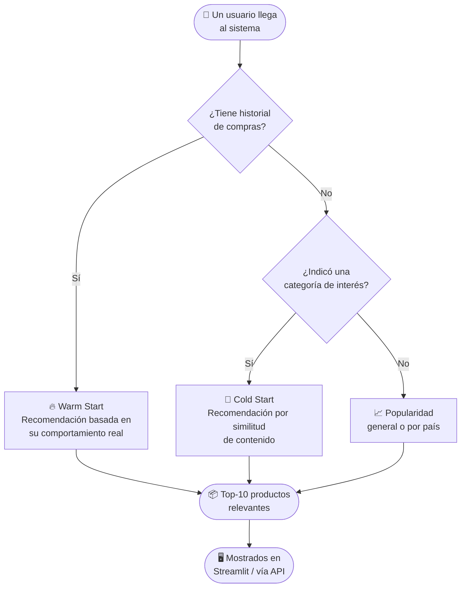

---

## 🏗️ Arquitectura del sistema

### Arquitectura general

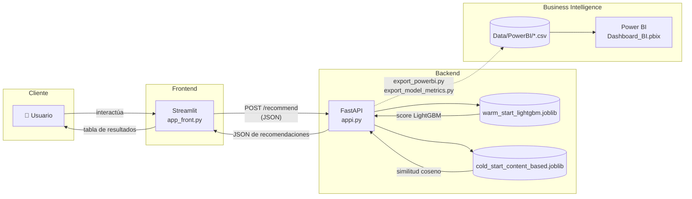

La separación entre API y frontend permite que el modelo pueda ser consumido por otras aplicaciones además del dashboard de Streamlit — cualquier cliente HTTP puede llamar a la API directamente (ver [sección API](#-api-fastapi)).

### Arquitectura de despliegue

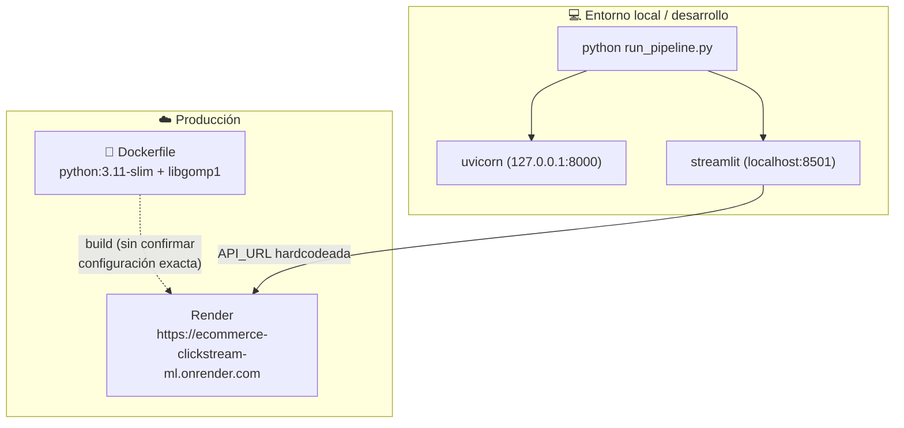


### Dependencias entre componentes

Grafo de imports de Python entre los módulos de `SRC/` (no incluye módulos de terceros):

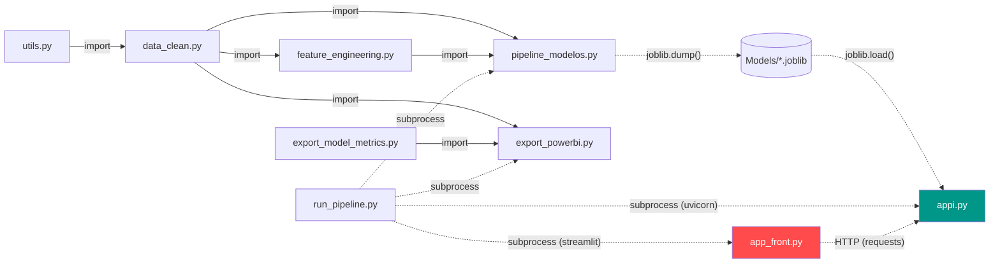

>> **Nota técnica:** La arquitectura de despliegue fue diseñada con una clara separación entre el entrenamiento de los modelos y su consumo en producción. La API (`appi.py`) utiliza únicamente los modelos previamente entrenados almacenados en la carpeta `Models/` y la información mínima necesaria para soportar algunas reglas de recomendación, como la popularidad por país. Por su parte, la aplicación web (`app_front.py`) interactúa exclusivamente con la API mediante solicitudes HTTP. Gracias a este desacoplamiento, el despliegue en producción no requiere incluir los módulos utilizados durante las etapas de preparación de datos, ingeniería de características o entrenamiento de modelos, lo que simplifica el mantenimiento, reduce dependencias y facilita la escalabilidad de la solución.

---

## 📁 Estructura del repositorio

```
ecommerce-clickstream-ml/
│
├── Data/
│   └── Raw/                                # CSVs originales (7 tablas)
│       ├── customers.csv
│       ├── products.csv
│       ├── orders.csv
│       ├── order_items.csv
│       ├── sessions.csv
│       ├── events.csv
│       └── reviews.csv
│       # Data/Processed/ y Data/PowerBI/ se generan localmente
│       # (no están versionadas — ver .gitignore) al correr
│       # feature_engineering.py y export_powerbi.py
│
├── Notebooks/
│   ├── 01_business_understanding.ipynb     # Contexto del negocio
│   ├── 02_eda_general.ipynb                # Análisis exploratorio de las 7 tablas
│   ├── 03_data_preparation.ipynb           # Limpieza y validación
│   ├── 04_feature_engineering.ipynb        # Construcción de features
│   └── 05_recommender_model.ipynb          # Entrenamiento y comparación de 6 modelos
│
├── SRC/
│   ├── utils.py                            # Funciones utilitarias (carga de CSV, validación FK)
│   ├── data_clean.py                       # Pipeline de limpieza completo
│   ├── feature_engineering.py              # Pipeline de feature engineering completo
│   ├── pipeline_modelos.py                 # Entrenamiento reproducible (warm + cold start)
│   ├── export_model_metrics.py             # Exporta métricas de modelos para Power BI
│   ├── export_powerbi.py                   # Exporta las 7 tablas limpias para Power BI
│   ├── appi.py                             # API REST (FastAPI)
│   └── app_front.py                        # Interfaz interactiva (Streamlit)
│
├── Models/
│   ├── warm_start_lightgbm.joblib          # Modelo + artefactos para usuarios con historial
│   └── cold_start_content_based.joblib     # Modelo + artefactos para usuarios/productos nuevos
│
├── Dashboard_BI.pbix                       # Dashboard de Power BI
├── run_pipeline.py                         # Orquestador: entrena + exporta + levanta API/frontend
├── Dockerfile                              # Imagen de contenedor para la API
├── requirements.txt
├── .dockerignore
├── .gitignore
└── README.md
```

<details>
<summary>📌 <strong>¿Qué archivo edito si quiero...?</strong> (click para expandir)</summary>
<br>

| Quiero... | Edito... |
|---|---|
| Cambiar cómo se limpian los datos crudos | `SRC/data_clean.py` |
| Cambiar qué features se calculan | `SRC/feature_engineering.py` |
| Cambiar hiperparámetros o la lógica de entrenamiento | `SRC/pipeline_modelos.py` |
| Agregar o cambiar un endpoint de la API | `SRC/appi.py` |
| Cambiar la interfaz visual | `SRC/app_front.py` |
| Cambiar qué se exporta a Power BI | `SRC/export_powerbi.py` / `SRC/export_model_metrics.py` |
| Cambiar cómo se arma la imagen Docker | `Dockerfile` |

</details>

---

## 📊 Dataset

Dataset sintético de e-commerce con ~1 millón de registros en 7 tablas relacionadas.

### Tablas

| Tabla | Registros (crudos) | Columnas | Descripción |
|-------|--------------------:|:--------:|-------------|
| `customers` | 20,000 | 7 | `customer_id, name, email, country, age, signup_date, marketing_opt_in` |
| `products` | 1,197 | 6 | `product_id, category, name, price_usd, cost_usd, margin_usd` |
| `orders` | 33,580 | 10 | `order_id, customer_id, order_time, payment_method, discount_pct, subtotal_usd, total_usd, country, device, source` |
| `order_items` | 59,163 | 5 | `order_id, product_id, unit_price_usd, quantity, line_total_usd` |
| `sessions` | 120,000 | 6 | `session_id, customer_id, start_time, device, source, country` |
| `events` | 760,958 | 10 | `event_id, session_id, timestamp, event_type, product_id, qty, cart_size, payment, discount_pct, amount_usd` |
| `reviews` | 10,780 | 6 | `review_id, order_id, product_id, rating, review_text, review_time` |

### Modelo entidad-relación

Relaciones definidas por `validar_integridad()` en `SRC/data_clean.py` — las 7 validaciones de FK→PK del código, con **0 registros huérfanos** en las 7:

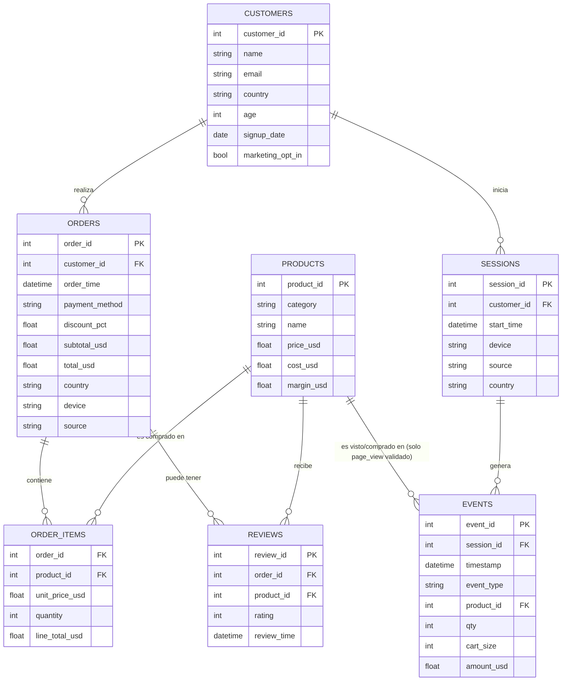

### Tipos de evento (`events.event_type`)

El clickstream tiene **4 etapas de funnel**, no 3 — `checkout` es una etapa real e intermedia entre `add_to_cart` y `purchase`:

| Evento | Cantidad | Peso en `EVENT_WEIGHTS` |
|--------|---------:|:------------------------:|
| `page_view` | 539,343 | 1 |
| `add_to_cart` | 143,126 | 3 |
| `checkout` | 44,909 | ⚠️ sin peso propio (cae en 1 por defecto, igual que `page_view`) |
| `purchase` | 33,580 | 5 |

### Estadísticas clave

- **Rango temporal:** 2020-01-01 a 2025-11-01
- **Países representados:** 17 (`AE, AU, BR, CA, DE, ES, FR, GB, IN, JP, MX, NL, PL, SE, SG, US, ZA`) — consistentes entre `customers`, `orders` y el selector del frontend
- **Categorías de producto:** 7 (`Beauty, Books, Electronics, Fashion, Home & Kitchen, Sports, Toys`)
- **Rating promedio de reseñas:** **3.93 / 5** (calculado sobre `reviews.csv` crudo)

### Problemas de calidad detectados

| Problema | Alcance | Solución aplicada |
|----------|---------|-------------------|
| Fechas anteriores al registro del cliente | ~50% de `orders`, `sessions` y `events` | Corrección automática: fecha de referencia + offset aleatorio (semilla 42) |
| Duplicados en `order_items` | 73 filas exactas | Eliminación de duplicados exactos |
| Duplicados en `reviews` | 4 exactas + 11 contradictorias resueltas (22 filas involucradas en pares) | Eliminación de exactas; se conserva la más reciente en las contradictorias |
| `review_text` no utilizable | 100% de las reseñas | Eliminación de la columna (5 frases fijas 1:1 con `rating`, NLP imposible) |
| Clientes sin sesiones | 55 clientes (0.27%) | Reporte sin modificación (quedan como cold start) |

---

## 🔄 Pipeline de datos (CRISP-DM)

El proyecto sigue las 5 etapas de CRISP-DM, más dos etapas de despliegue (API/Frontend) y BI que se agregaron en el Sprint 2.

### Vista general

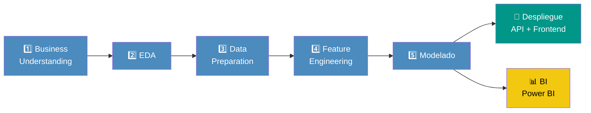

### 1. Business Understanding

**Archivo:** `Notebooks/01_business_understanding.ipynb`

En esta fase se definió el objetivo del proyecto, el alcance de la solución y los criterios de éxito del negocio. Se identificó la necesidad de desarrollar un sistema de recomendación capaz de personalizar la experiencia de compra utilizando la información histórica de clientes, productos, pedidos y eventos de navegación, con el propósito de mejorar la conversión, facilitar el descubrimiento de productos y apoyar la estrategia comercial de la plataforma.

---

### 2. Exploratory Data Analysis (EDA)

**Archivo:** `Notebooks/02_eda_general.ipynb`

Se realizó un análisis exploratorio integral de las **siete tablas** que conforman el ecosistema de datos del proyecto, permitiendo comprender el comportamiento de los usuarios, evaluar la calidad de la información e identificar oportunidades para el desarrollo del sistema de recomendación.

El análisis incluyó:

- Distribución de variables numéricas como edad, precios, montos de compra y calificaciones.
- Análisis de las relaciones entre clientes, pedidos, productos, sesiones, eventos y reseñas.
- Evaluación de calidad de datos mediante la identificación de valores nulos, registros duplicados y validación de tipos de datos.
- Análisis del embudo de conversión del proceso de compra.

| Etapa | Sesiones |
|-------|---------:|
| Page View | 120,000 |
| Add to Cart | 81,518 |
| Checkout | 44,909 |
| Purchase | 33,580 |

El análisis evidenció una **conversión global del 27.98 %**, identificando que la mayor pérdida de usuarios ocurre entre las etapas **Add to Cart** y **Checkout**, donde la conversión es del **55.1 %**. Este hallazgo representa una oportunidad para incorporar recomendaciones personalizadas durante uno de los momentos de mayor intención de compra.

Adicionalmente, se detectaron inconsistencias de calidad en aproximadamente el **50 %** de algunos registros relacionados con fechas en las tablas **Orders**, **Sessions** y **Events**, donde ciertos eventos ocurrían antes de la fecha de registro del cliente. Estos hallazgos fueron considerados durante la fase de preparación de datos para garantizar la confiabilidad de la información utilizada por los modelos.

---

### 3. Data Preparation

**Archivos:** `Notebooks/03_data_preparation.ipynb` · `SRC/data_clean.py`

En esta etapa se implementó el proceso de limpieza, validación y estandarización de la información proveniente de las siete tablas del proyecto. El notebook documenta de manera detallada cada transformación realizada, mientras que el módulo `data_clean.py` concentra la implementación reutilizable del proceso mediante la función principal **`limpiar_tablas()`**, facilitando su ejecución tanto durante el entrenamiento de los modelos como en futuros procesos de actualización de datos.

Las actividades desarrolladas incluyen:

- Estandarización de formatos y tipos de datos.
- Tratamiento de valores faltantes y registros duplicados.
- Validación de reglas de integridad y consistencia.
- Corrección de inconsistencias temporales detectadas durante el análisis exploratorio.
- Generación de conjuntos de datos listos para las etapas de Feature Engineering y Modelado.

#### Diagrama de flujo del pipeline de limpieza

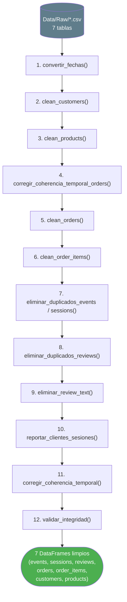

| Paso | Función | Qué hace |
|------|---------|----------|
| 1 | `convertir_fechas()` | Convierte todas las columnas de fechas a datetime |
| 2 | `clean_customers()` | Valida nulos, duplicados, rango de edad (18-100), formato de email |
| 3 | `clean_products()` | Valida nulos, duplicados, precios > 0, costo ≤ precio, margen consistente |
| 4 | `corregir_coherencia_temporal_orders()` | Corrige `order_time` para que sea ≥ `signup_date` del cliente |
| 5 | `clean_orders()` | Valida nulos, duplicados, montos > 0, descuento 0-100%, total consistente, FK a `customers` |
| 6 | `clean_order_items()` | Elimina duplicados, valida montos, FK a `products` y `orders` |
| 7 | `eliminar_duplicados_events()` / `eliminar_duplicados_sessions()` | Verifican que no haya duplicados exactos (no los hay) |
| 8 | `eliminar_duplicados_reviews()` | Elimina duplicados exactos y resuelve contradicciones (ver tabla abajo) |
| 9 | `eliminar_review_text()` | Elimina la columna `review_text` |
| 10 | `reportar_clientes_sesiones()` | Reporta 55 clientes sin sesiones (sin modificar) |
| 11 | `corregir_coherencia_temporal()` | Corrige fechas de `events`, `sessions` y `reviews` para respetar `signup ≤ order ≤ review` |
| 12 | `validar_integridad()` | Valida 7 relaciones FK → PK |

#### Resultados de la limpieza

| Tabla | Filas antes | Filas después | Acciones |
|-------|------------:|---------------:|----------|
| `customers` | 20,000 | 20,000 | Sin modificaciones (validación OK) |
| `products` | 1,197 | 1,197 | Sin modificaciones (validación OK) |
| `orders` | 33,580 | 33,580 | 16,923 fechas corregidas (50.4%) |
| `order_items` | 59,163 | 59,090 | 73 duplicados eliminados |
| `sessions` | 120,000 | 120,000 | 60,411 fechas corregidas |
| `events` | 760,958 | 760,958 | 382,899 fechas corregidas |
| `reviews` | **10,780** | **10,765** | 4 duplicados exactos + 11 contradictorios resueltos (15 filas eliminadas), `review_text` eliminada, 7,604 fechas corregidas |

> **✅ Integridad referencial:** las 7 relaciones FK → PK (`events→sessions`, `sessions→customers`, `reviews→orders`, `reviews→products`, `order_items→orders`, `order_items→products`, `events→products`) no presentan registros huérfanos.

---

### 4. Feature Engineering

**Archivos:** `Notebooks/04_feature_engineering.ipynb` + `SRC/feature_engineering.py`

Construcción de las estructuras de entrada para los modelos de recomendación. Función principal: `generar_features()`.

#### Diagrama de flujo del feature engineering

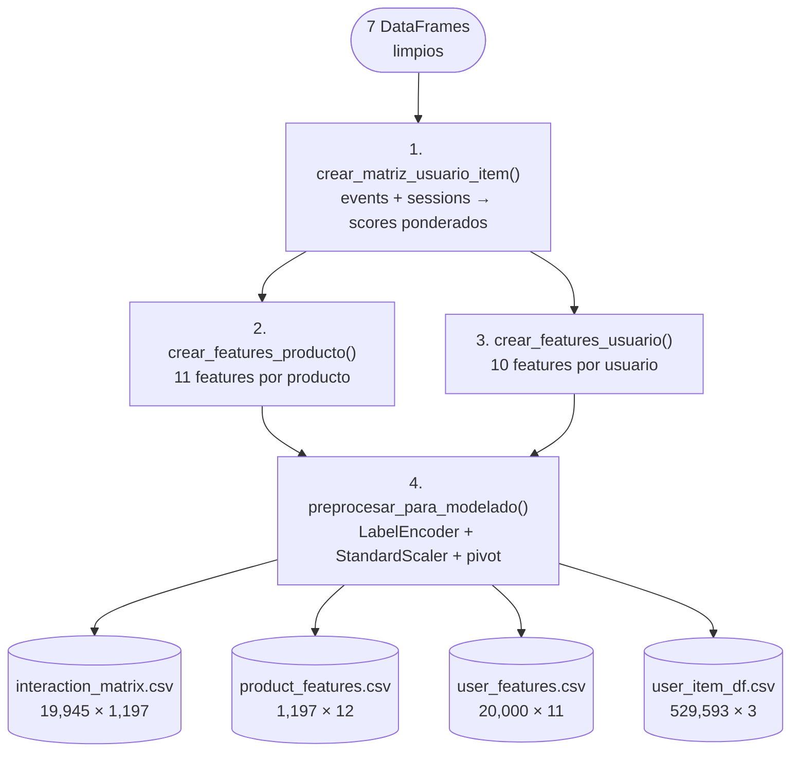

#### 4.1 Matriz usuario-item (para collaborative filtering)

Une `events` con `sessions` para obtener `customer_id`, pondera por tipo de evento (`EVENT_WEIGHTS`) y agrupa por `(customer_id, product_id)`:

| Métrica | Valor |
|---------|------:|
| Usuarios únicos | 19,945 |
| Productos únicos | 1,197 |
| Interacciones | 529,593 |
| Pares posibles | 23,874,165 |
| **Sparsity** | **97.78%** |

#### 4.2 Features de producto (content-based y cold start)

11 features por producto: `category, price_usd, cost_usd, margin_usd, n_views, n_cart, n_purchases, popularidad, rating_promedio, n_ratings` (+ `product_id`).

#### 4.3 Features de usuario (cold start)

10 features por usuario: `age, country, marketing_opt_in, n_sessions, n_purchases, ticket_promedio, n_products_viewed, n_products_carted, rating_promedio_usr` (+ `customer_id`).

#### 4.4 Archivos de salida (`Data/Processed/`, generados localmente, no versionados)

| Archivo | Dimensiones |
|---------|-------------|
| `interaction_matrix.csv` | 19,945 × 1,197 |
| `product_features.csv` | 1,197 × 12 |
| `user_features.csv` | 20,000 × 11 |
| `user_item_df.csv` | 529,593 × 3 |

---

## 🧠 Modelado

**Archivos:** `Notebooks/05_recommender_model.ipynb` (evaluación y comparación de seis enfoques de recomendación) · `SRC/pipeline_modelos.py` (pipeline reproducible de entrenamiento de los modelos seleccionados para producción)

Durante esta fase se diseñó y validó el motor de recomendación siguiendo buenas prácticas de Machine Learning orientadas a escenarios reales de producción. El proceso de entrenamiento se basa en las interacciones históricas entre usuarios y productos, construyendo ejemplos positivos a partir de las interacciones observadas y ejemplos negativos obtenidos mediante un muestreo basado en la popularidad de los productos, permitiendo al modelo aprender a diferenciar entre recomendaciones relevantes y no relevantes.

Con el fin de representar de manera realista el comportamiento futuro de los usuarios, se implementó un **split temporal 80/20**, utilizando el 80 % de las interacciones más antiguas para entrenamiento y el 20 % más reciente para evaluación. Asimismo, todas las variables derivadas de usuarios y productos fueron calculadas únicamente con información disponible antes del punto de corte temporal, garantizando que el entrenamiento reproduzca las condiciones que tendría el modelo en un entorno de producción.

> **Nota metodológica:** Durante el proceso de desarrollo se revisó y fortaleció la metodología de entrenamiento para garantizar la confiabilidad de los resultados. Entre las mejoras incorporadas se encuentran la adopción de una partición temporal de los datos, el recálculo de las variables utilizando únicamente información histórica disponible, una estrategia más representativa para la generación de ejemplos negativos y un proceso de validación independiente para la selección del umbral de decisión. Estas mejoras permitieron eliminar posibles sesgos de evaluación y obtener métricas más robustas y representativas del desempeño esperado en producción.
### Diagrama del proceso de entrenamiento (anti-leakage)

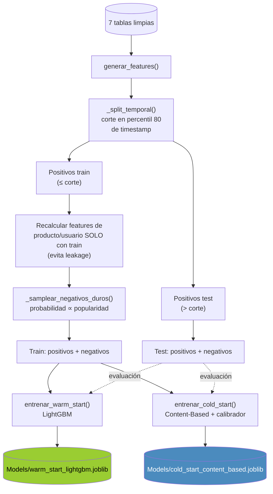

### Resultados reales (tabla `tabla_comparativa`, notebook 05, ordenada por NDCG@K)

| Modelo | Accuracy | Precision | Recall | F1 | MAP@K | NDCG@K |
|--------|---------:|----------:|-------:|----:|------:|-------:|
| XGBoost | 0.2968 | 0.6432 | 0.2193 | 0.3271 | 0.8785 | **0.9275** |
| CatBoost | 0.2963 | 0.6421 | 0.2191 | 0.3267 | 0.8783 | 0.9273 |
| **LightGBM** | 0.2948 | 0.6405 | 0.2165 | 0.3237 | 0.8781 | 0.9272 |
| NGBoost | 0.2937 | 0.6390 | 0.2151 | 0.3219 | 0.8780 | 0.9272 |
| Collaborative Filtering (SVD) | 0.2619 | 0.6435 | 0.1184 | 0.2000 | 0.8625 | 0.9143 |
| Content-Based Filtering | **0.3767** | **0.6864** | **0.3683** | **0.4794** | 0.8555 | 0.9102 |

## 🤖 Motor de recomendación

Uno de los principales retos del comercio electrónico es ofrecer recomendaciones relevantes tanto a clientes con historial de compras como a nuevos usuarios que aún no han interactuado con la plataforma. Resolver ambos escenarios permite mejorar la experiencia de compra, aumentar la probabilidad de conversión y facilitar el descubrimiento de productos de interés.

Con este objetivo, durante el desarrollo del proyecto se evaluaron diferentes enfoques de recomendación, entre ellos **LightGBM, XGBoost, CatBoost, NGBoost, SVD y Content-Based Filtering**. Después de analizar su desempeño, se diseñó una **estrategia híbrida** que aprovecha las fortalezas de cada modelo según el contexto del usuario.

Para los clientes que ya cuentan con historial de interacción, el sistema utiliza **LightGBM (Warm Start)**, ya que puede aprender patrones de comportamiento a partir de compras, visualizaciones e interacciones previas, generando recomendaciones altamente personalizadas. En cambio, para usuarios nuevos o productos sin historial, el sistema emplea **Content-Based Filtering (Cold Start)**, recomendando productos similares a partir de sus características, como la categoría y otros atributos disponibles.

Esta estrategia permite ofrecer recomendaciones en ambos escenarios sin depender de un único modelo, garantizando que el sistema pueda responder tanto a usuarios recurrentes como a nuevos clientes desde su primera interacción. Los modelos entrenados y los artefactos necesarios para realizar las inferencias se almacenan mediante `joblib` en la carpeta `Models/` y son cargados automáticamente por la API al iniciar la aplicación.

### Estrategia de recomendación

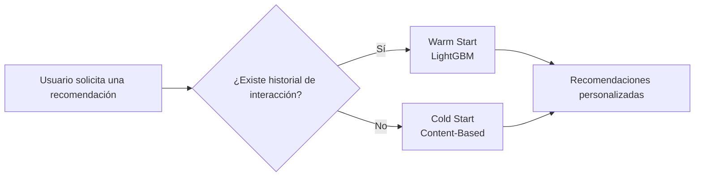

---

## ⚡ API REST

La API, desarrollada con **FastAPI**, actúa como la capa de integración entre el frontend y el motor de recomendación. Su responsabilidad es recibir las solicitudes de los usuarios, identificar el escenario de negocio correspondiente, seleccionar automáticamente el modelo adecuado y devolver las recomendaciones en tiempo real. Además, centraliza el acceso al catálogo de productos, la consulta de usuarios y las métricas de desempeño de los modelos, facilitando la integración con aplicaciones web o futuros canales digitales.

La documentación interactiva de la API se encuentra disponible mediante **Swagger** (`/docs`) y **ReDoc** (`/redoc`).

### Endpoints principales

| Método | Endpoint | Descripción |
|---------|----------|-------------|
| `GET` | `/` | Consulta el estado de la API y la información general del sistema. |
| `GET` | `/health` | Verifica que el servicio se encuentre disponible. |
| `POST` | `/recommend` | Genera recomendaciones personalizadas para un usuario según su contexto e historial. |
| `GET` | `/model-metrics` | Consulta las métricas de desempeño de los modelos implementados. |
| `GET` | `/products` | Obtiene el catálogo de productos disponible para recomendación. |
| `GET` | `/users/{customer_id}` | Recupera la información de un usuario específico. |
| `GET` | `/users-list` | Devuelve la lista de usuarios disponibles para realizar pruebas desde la interfaz. |
### Flujo completo: Usuario → Frontend → API → Modelo → Recomendación

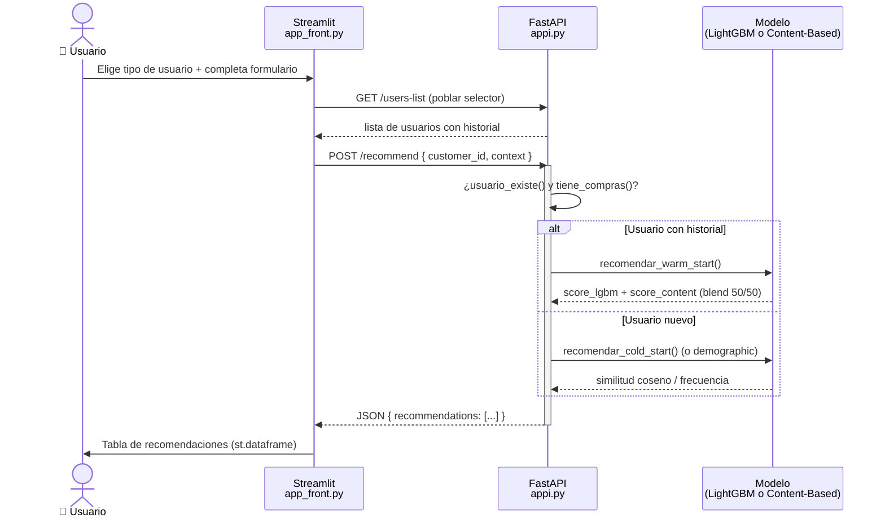

### `POST /recommend`

**Cuerpo de la solicitud** (`RecommendationRequest`):

```json
{
  "customer_id": 123,
  "context": { "age": 30, "country": "US", "category": "Electronics" },
  "country": null,
  "age": null
}
```

| Campo | Tipo | Obligatorio | Notas |
|-------|------|:---:|-------|
| `customer_id` | int | Sí | |
| `context` | dict | No (default `{}`) | El frontend real solo usa `context.age`, `context.country`, `context.category` |
| `country` | str | No (default `null`) | Campo raíz — junto con `age`, habilita la rama demográfica (ver nota abajo) |
| `age` | int | No (default `null`) | Campo raíz |

**Lógica de selección de modelo:**

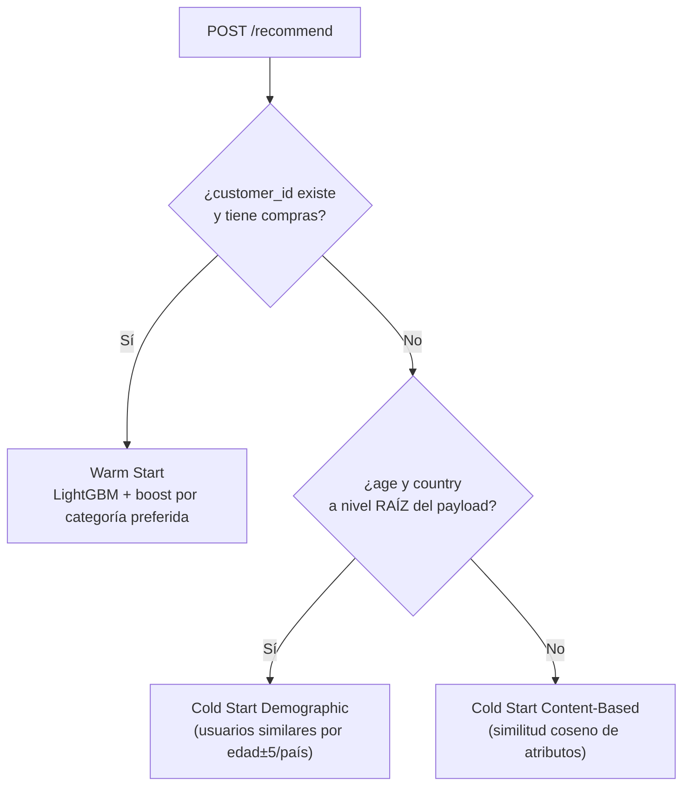


#### Flujo interno — Warm Start

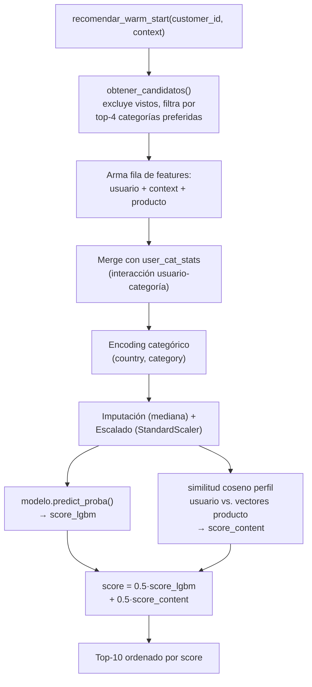

#### Flujo interno — Cold Start

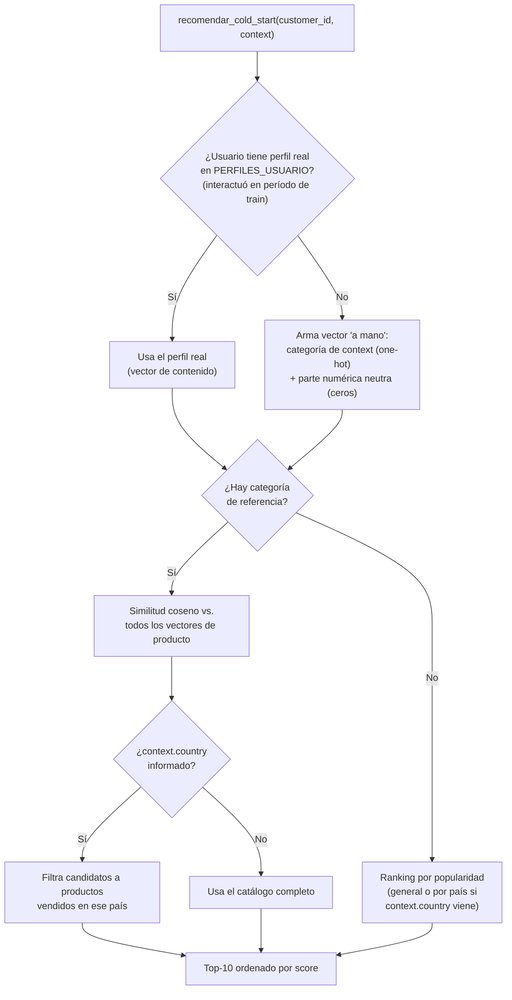

**Respuesta (warm start, ejemplo real de la forma que arma el código):**

```json
{
  "customer_id": 123,
  "modelo": "Warm Start (LightGBM)",
  "usuario_con_historial": true,
  "historial": { "age": 34, "country": "US", "n_purchases_user": 5, "...": "..." },
  "recommendations": [
    {
      "product_id": 55,
      "product_name": "...",
      "category": "electronics",
      "price": 29.99,
      "score": 0.8734,
      "reason": "Recommended by LightGBM + Content-Based"
    }
  ]
}
```

Para warm start, el score final es un blend: `score = 0.5 * score_LightGBM + 0.5 * similitud_coseno_content_based` (`ALPHA = 0.5`, `SRC/appi.py`).

---

## 🌐 Frontend (Streamlit)

**Archivo:** `SRC/app_front.py` · Consume la API vía `requests`, apuntando a `API_URL = "https://ecommerce-clickstream-ml.onrender.com"` (hardcodeado en el código).

Flujo de la aplicación:

1. **Estado del sistema** (sidebar): consulta `GET /`, muestra cantidad de usuarios/productos y si la API está conectada; expande métricas de ambos modelos vía `GET /model-metrics`.
2. **Selección de tipo de usuario:**
   - *Usuario con historial* → selector (`st.selectbox`) poblado desde `GET /users-list`; al elegir un usuario, se consulta `GET /users/{customer_id}` y se bloquean (`disabled`) los campos de edad y país, que se prellenan con los datos reales del historial — solo la categoría favorita queda editable.
   - *Usuario nuevo* → se eligen país (opcional, "Todos los países" por defecto) y categoría de interés; no hay campo de edad en este flujo.
3. Al enviar, arma el payload y hace `POST /recommend` (`requests.post`, con `json=payload`).
4. Muestra los resultados como tabla (`st.dataframe`) con columnas Product ID, Producto, Categoría, Precio (USD), Score y Motivo, más el historial del usuario (si aplica) en un panel expandible.

### Navegación del sistema (estados de la interfaz)

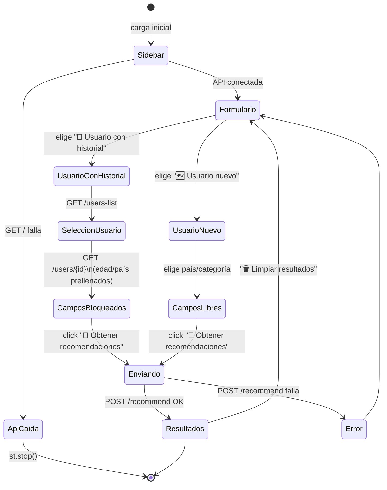

### Listas hardcodeadas en el frontend

> **✅ Consistencia de datos:** las listas hardcodeadas del frontend coinciden exactamente con los datos reales.
> - **17 países:** `PAISES` (código → nombre completo) coincide exactamente con los 17 códigos de país presentes en `customers.csv`/`orders.csv`.
> - **7 categorías:** `CATEGORIAS` coincide exactamente con las 7 categorías de `products.csv`.

---

## 🐳 Despliegue

### Docker (API)

```dockerfile
FROM python:3.11-slim
# instala libgomp1 (requerido por LightGBM) + dependencias de requirements.txt
# copia SRC/ y Models/
CMD ["uvicorn", "SRC.appi:app", "--host", "0.0.0.0", "--port", "8000"]
```


### Render

El frontend apunta a `https://ecommerce-clickstream-ml.onrender.com` como URL de producción de la API. No hay un `render.yaml` versionado en el repositorio, así que no se pudo verificar de forma independiente cómo Render construye exactamente esa imagen.

### Orquestador local (`run_pipeline.py`)

```bash
python run_pipeline.py               # entrena modelos + exporta a Power BI + levanta API y frontend
python run_pipeline.py --no-servers  # solo entrena y exporta, sin levantar servidores
```

> [!NOTE]
> Este script asume un layout de entorno virtual de Windows (`venv/Scripts/python.exe`) y su función de liberar puertos ocupados es un no-op en Linux/Mac.

---

## 📈 Dashboard Power BI

El proyecto incluye un dashboard desarrollado en **Power BI**, diseñado para facilitar el análisis de los datos procesados, el comportamiento de los usuarios y el rendimiento del sistema de recomendación. A través de diferentes vistas es posible explorar indicadores de negocio, métricas de los modelos y resultados obtenidos durante el proyecto.

### Vista general del dashboard

<p align="center">
  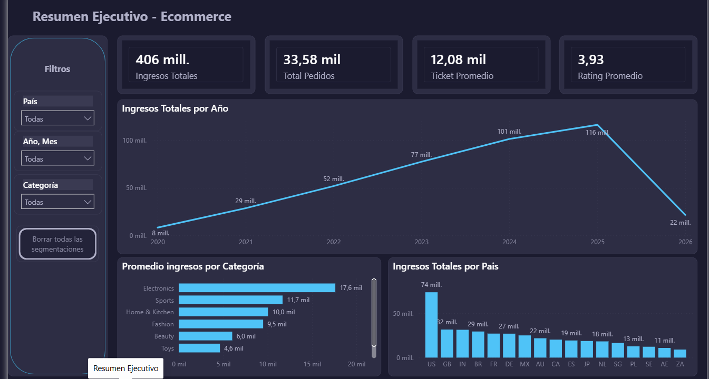
</p>

### Análisis ejecutivo

El dashboard presenta una visión consolidada del comportamiento comercial de la plataforma de e-commerce a partir de los datos procesados durante el proyecto. Se observa un crecimiento sostenido de los ingresos entre 2020 y 2025, alcanzando un máximo cercano a los **USD 116 millones**, seguido por una disminución en 2026 debido a que el conjunto de datos únicamente incluye información parcial para ese año.

Los indicadores generales muestran más de **33 mil pedidos**, un **ticket promedio de USD 12,08 mil** y una **calificación promedio de 3,93/5**, lo que permite caracterizar el desempeño comercial y la percepción de los clientes.

Desde la perspectiva del negocio, **Electronics** concentra el mayor ingreso promedio por categoría, mientras que **Estados Unidos** representa el mercado con mayor volumen de ventas, seguido por Reino Unido e India. Estos resultados permiten identificar mercados y categorías estratégicas para orientar campañas comerciales y complementar las recomendaciones generadas por el sistema.

### Flujo de generación de datos

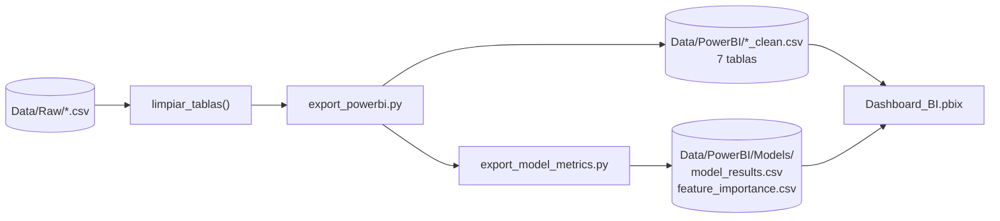

Los datos que alimentan el dashboard son generados automáticamente mediante los siguientes scripts:

| Script | Archivos generados | Descripción |
|---------|-------------------|-------------|
| `SRC/export_powerbi.py` | `Data/PowerBI/*_clean.csv` | Exporta las tablas procesadas utilizadas por Power BI. |
| `SRC/export_model_metrics.py` | `Data/PowerBI/Models/` | Exporta las métricas de evaluación y la importancia de variables del modelo. |

Para actualizar la información utilizada por el dashboard basta con ejecutar:

```bash
python SRC/export_powerbi.py
```

---

## ▶️ Cómo ejecutar

### Requisitos

- Python 3.10 o superior
- Aproximadamente 500 MB de espacio disponible

### Instalación

```bash
git clone <url>
cd ecommerce-clickstream-ml

python -m venv venv

# Windows
venv\Scripts\activate

# Linux / macOS
source venv/bin/activate

pip install -r requirements.txt

# Solo si se desea ejecutar el Notebook 05
pip install catboost ngboost
```
## 📦 Dependencias

El proyecto utiliza las siguientes librerías y herramientas principales:

| Paquete | Versión | Propósito |
|---------|:---:|-------------|
| pandas | 3.0.3 | Manipulación y análisis de datos |
| numpy | 2.4.6 | Operaciones numéricas |
| scikit-learn | 1.9.0 | Preprocesamiento, métricas y utilidades de Machine Learning |
| seaborn / matplotlib | — | Visualización de datos |
| jupyter / notebook / ipykernel / ipywidgets | — | Desarrollo de notebooks |
| xgboost | 3.2.0 | Modelo evaluado durante la experimentación |
| lightgbm | — | Modelo utilizado para el motor Warm Start |
| catboost | — | Modelo incluido en la comparación experimental |
| ngboost | — | Modelo incluido en la comparación experimental |
| fastapi / uvicorn | — | Desarrollo de la API REST |
| streamlit | — | Interfaz web |
| joblib | 1.5.3 | Serialización de modelos |
| scipy | — | Funciones científicas y matemáticas |
| pydantic | — | Validación de datos |
| openpyxl | — | Lectura y escritura de archivos Excel |
| python-dotenv | — | Gestión de variables de entorno |
| db-dtypes | — | Tipos de datos para conectores de bases de datos |

> Para ejecutar el Notebook 05 es necesario instalar adicionalmente **CatBoost** y **NGBoost**, ya que no hacen parte del archivo `requirements.txt`.

---

## Consideraciones del proyecto

El sistema fue desarrollado utilizando un dataset sintético de comercio electrónico. Aunque reproduce escenarios representativos de una plataforma real, algunas distribuciones de los datos son más homogéneas de lo que normalmente se observa en producción. Durante la etapa de preparación se realizaron procesos de limpieza y corrección de coherencia temporal para garantizar la consistencia de la información utilizada en el entrenamiento de los modelos.

La matriz usuario-producto presenta una dispersión del **97.78 %**, una característica común en sistemas de recomendación. Por esta razón se implementó una estrategia híbrida que combina un modelo **Warm Start** para usuarios con historial y un modelo **Cold Start** para nuevos usuarios o productos.

Actualmente el flujo demográfico de **Cold Start** se encuentra implementado en la API, aunque la interfaz desarrollada en Streamlit utiliza el flujo basado en categorías. Asimismo, el proyecto fue desarrollado y probado principalmente en un entorno Windows, por lo que en otros sistemas operativos pueden requerirse pequeños ajustes de configuración.

Al tratarse de un proyecto académico construido sobre datos sintéticos, la API no incorpora mecanismos de autenticación. En un escenario de producción sería recomendable añadir controles de acceso antes de su despliegue.

---

<div align="center">

*Desarrollado como Proyecto Final del Bootcamp de Data Science de Henry.*

</div>


---

